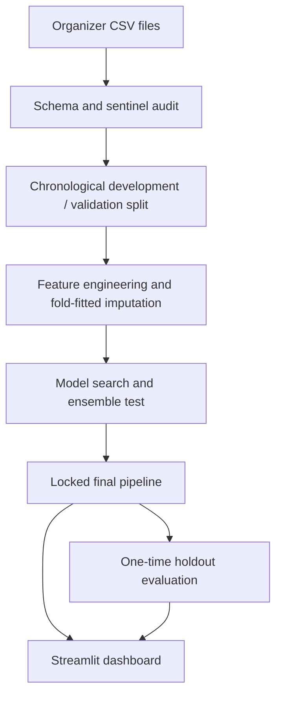

# Air-ritated

## Explainable Carbon Monoxide Intelligence & Early Warning Platform

Air-ritated is a complete Hack-ML Track 1 project that estimates hourly carbon
monoxide concentration from gas-sensor and environmental observations. It pairs
a leakage-controlled regression pipeline with a six-part Streamlit product for
prediction, explanation, patterns, scenario exploration, data quality and model
diagnostics.

> **Measured result:** the final model achieved **0.3824 MAE**, **0.5889 RMSE**
> and **0.8162 R²** on 1,781 valid labels in the untouched chronological holdout.

## Problem

Raw sensor feeds are difficult to interpret and frequently incomplete. The
hackathon asks us to predict `CO(GT)`, the hourly reference-analyzer carbon
monoxide concentration, from deployed sensor responses and environmental
conditions.

The supplied data supports **contemporaneous CO estimation (nowcasting)**. It
does not provide a defined future prediction horizon, so Air-ritated deliberately
does not claim to forecast tomorrow's pollution.

## Our Solution

Air-ritated combines:

- a reproducible time-aware training pipeline;
- automatic recognition of the dataset's `-200` missing-value sentinel;
- leakage-safe cyclical time features;
- seven candidate regressors plus an evidence-tested voting ensemble;
- an untouched organizer holdout evaluated only after final model selection;
- global permutation importance and local median-perturbation explanations;
- an input-constrained scenario lab;
- a transparent sensor/data-quality score; and
- a polished Streamlit dashboard designed for a live three-minute demo.

## Why It Matters

Environmental teams need more than a number. They need to know whether inputs
are usable, why a model produced its estimate, and where it fails. Air-ritated
puts these engineering questions beside the prediction instead of hiding them.
The architecture can later sit behind real sensor ingestion and alerting, but
this hackathon build stays within what the supplied static dataset can support.

## Dataset

Organizer repository: [HACK_ML_DATASET](https://github.com/viciouss28/HACK_ML_DATASET)

The provided split contains:

| File | Rows | Columns | Role |
|---|---:|---:|---|
| `train.csv` | 7,485 | 15 | Training features + `CO(GT)` |
| `test.csv` | 1,872 | 14 | Chronologically later features |
| `test_labels.csv` | 1,872 | 2 | Sealed final ground truth |
| `data_dictionary.csv` | 15 | 3 | Organizer schema |

Training covers **10 Mar 2004 18:00 through 16 Jan 2005 14:00**. Test begins at
the next hour and ends **4 Apr 2005 14:00**. Both are ordered and strictly
separated. The values match the UCI Air Quality field conventions: hourly
multisensor observations, `CO(GT)` in mg/m³, and `-200` marking missing values.
See the [UCI Air Quality dataset page](https://archive.ics.uci.edu/dataset/360/air+quality).

### Audit findings

- No ordinary CSV nulls and no duplicate rows were present.
- `-200` occurs in 1,592 training targets; those rows are excluded from fitting.
- `NMHC(GT)` is invalid in 6,571/7,485 training rows and every test row, so it is
  dropped based on an 80% development-set missingness threshold.
- Other invalid feature readings become `NaN` and are median-imputed inside the
  fitted pipeline.
- 91 test labels are `-200`; predictions are still produced for all 1,872 test
  rows, while final metrics use the 1,781 valid reference labels.
- The data source documents sensor/concept drift, making a chronological split
  more defensible than random shuffling.

The full machine-readable audit is in `outputs/data_audit.json`.

## Architecture



The saved `final_model.joblib` is a single scikit-learn pipeline containing the
learned imputation and model steps. Streamlit loads it once with
`@st.cache_resource`; it never retrains when a widget changes.

## Data Preprocessing

1. Parse `Date + Time` with malformed values coerced safely.
2. Confirm the source convention and convert numeric `-200` sentinels to `NaN`.
3. Remove training rows whose target is invalid.
4. Determine high-missingness columns from development data only.
5. Fit median imputation and missingness indicators inside each model pipeline.
6. Preserve an identical, explicitly ordered feature schema for validation,
   test and interactive scenarios.

No target-derived lags, rolling targets or test labels enter preprocessing.

## Feature Engineering

Final model inputs:

- `PT08.S1(CO)`, `C6H6(GT)`, `PT08.S2(NMHC)`, `NOx(GT)`,
  `PT08.S3(NOx)`, `NO2(GT)`, `PT08.S4(NO2)`, `PT08.S5(O3)`;
- temperature `T`, relative humidity `RH`, absolute humidity `AH`;
- `hour_sin`, `hour_cos`, `dow_sin`, `dow_cos`, `month_sin`, `month_cos`;
- `is_weekend`.

A pre-model ablation using the same Extra Trees probe found:

| Feature set | Validation MAE | RMSE | R² |
|---|---:|---:|---:|
| Sensors + calendar | 0.4773 | 0.7827 | 0.7863 |
| Sensors only | 0.4979 | 0.7971 | 0.7783 |

The cyclical features were therefore retained. No feature is included merely
for appearance.

## Models Evaluated

All numbers below were produced by `python -m src.train` on the chronological
validation window.

| Model | MAE | RMSE | R² |
|---|---:|---:|---:|
| **Linear Regression** | **0.4567** | **0.7251** | **0.8166** |
| Top-3 Voting Ensemble | 0.4629 | 0.7596 | 0.7987 |
| Extra Trees | 0.4829 | 0.7922 | 0.7811 |
| Random Forest | 0.4849 | 0.7937 | 0.7802 |
| CatBoost | 0.4923 | 0.7927 | 0.7808 |
| HistGradientBoosting | 0.5144 | 0.8302 | 0.7595 |
| XGBoost | 0.5247 | 0.8341 | 0.7572 |
| Dummy Mean | 1.3007 | 1.8271 | -0.1648 |

The simplest legitimate model won. The ensemble was rejected because its MAE
was worse, not because of a preference for simplicity.

## Validation Strategy

- Sort valid-target training observations chronologically.
- Reserve the final 20% (1,179 observations, 23 Nov 2004–16 Jan 2005) as a
  model-selection validation window.
- Use a three-fold expanding `TimeSeriesSplit` only inside the earlier 4,714-row
  development window for compact randomized hyperparameter searches.
- Lock features, preprocessing, model and ensemble decision.
- Refit the locked design on all 5,893 valid training observations.
- Only then access `test_labels.csv` for one final report.

This mirrors the organizer's strictly later test window and prevents future
observations from training models evaluated on earlier observations.

## Results

| Evaluation | Valid rows | MAE | RMSE | R² |
|---|---:|---:|---:|---:|
| Chronological validation | 1,179 | 0.4567 | 0.7251 | 0.8166 |
| Final organizer holdout | 1,781 | 0.3824 | 0.5889 | 0.8162 |

- **MAE** is the typical absolute miss in the target's units.
- **RMSE** penalizes larger misses more heavily.
- **R²** means the model explains about 81.6% of holdout target variance relative
  to predicting a constant mean; it does not mean 81.6% “accuracy.”

Predictions for every test row are in `outputs/test_predictions.csv`.

## Explainable AI

Global explanation uses permutation importance on the chronological validation
window. The leading features were `C6H6(GT)`, `PT08.S4(NO2)`,
`PT08.S2(NMHC)` and `NOx(GT)`.

Local explanation replaces one selected input at a time with its training
median and reports the corresponding change in model output. This is robust for
the saved pipeline and scenario UI, but interactions mean the contributions are
not additive.

Both views say **associated with** or **contributed to the model estimate**—never
“caused.”

## Dashboard Features

1. **Command Center** — selected prediction, actual reference when valid,
   environment snapshot, completeness and local trend.
2. **Explainable AI** — global validation importance and local model-behavior
   contributions.
3. **Pollution Patterns** — time, hour and correlation views with calculated
   insights.
4. **Scenario Lab** — percentile-bounded sensor/environment adjustments with an
   explicit non-causal warning.
5. **Data Quality** — missing, sentinel and unusual-input detection plus a fully
   explained completeness score.
6. **Model Lab** — measured comparison, final metrics, predicted-vs-actual and
   residual diagnostics.

## Installation

### Windows PowerShell

```powershell
git clone <your-Air-ritated-repository-url>
cd Air-ritated
py -m venv .venv
.\.venv\Scripts\Activate.ps1
python -m pip install --upgrade pip
pip install -r requirements.txt
```

### macOS / Linux

```bash
git clone <your-Air-ritated-repository-url>
cd Air-ritated
python3 -m venv .venv
source .venv/bin/activate
python -m pip install --upgrade pip
pip install -r requirements.txt
```

The four CSVs are included here. If removed, training attempts to download the
organizer repository automatically. You may also copy the CSVs manually into
`data/` for offline judging.

## Running the Project

Artifacts are already trained, so the fastest demo command is:

```bash
streamlit run app.py
```

To reproduce everything from data to artifacts:

```bash
python -m src.train
python -m unittest discover -s tests -v
streamlit run app.py
```

To predict another organizer-schema CSV:

```bash
python -m src.predict path/to/input.csv --output outputs/custom_predictions.csv
```

## Project Structure

```text
Air-ritated/
├── app.py
├── README.md
├── PITCH.md
├── JUDGE_QA.md
├── requirements.txt
├── data/                    # organizer CSVs + data notes
├── dashboard/               # theme and chart helpers
├── src/                     # audit, features, training, evaluation, prediction
├── models/                  # final fitted artifacts + metadata
├── outputs/                 # measured metrics, predictions and audit
├── notebooks/EDA.ipynb
└── tests/test_pipeline.py
```

## Limitations

- This is contemporaneous estimation, not a validated future-horizon forecast.
- It is a single location and historical period; geographic generalization is
  unknown.
- Sensor/concept drift can reduce future accuracy and requires monitoring.
- Median imputation is reliable and leakage-safe but may understate uncertainty
  during large sensor outages.
- The input completeness score is not calibrated prediction confidence.
- Scenario results reflect model behavior, not interventions or causal effects.
- No medical alerts or regulatory risk categories are claimed.

## Future Improvements

- Collect multiple sites and recent seasons, then validate by site and time.
- Add explicit 1-hour/6-hour forecast targets with strictly past-only lags.
- Add drift detection, retraining triggers and calibrated prediction intervals.
- Connect a streaming sensor layer and authenticated alert delivery.
- Evaluate robust models for contiguous multi-sensor outages.

## Team

Prepared for Muskan's Hack-ML team. Add final teammate names and roles before
submission.
